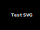

# Handle-svgs Extension For Quarto

This filter adds `.pdf` or `.emf` to the end of SVG file paths (depending on the output format) and tries to generate the according file via Inkscape if it doesn't exist.

```

```

will become

```

```

for `latex`, `pdf` and `beamer` output or

```

```

for `pptx` and `docx` output.

## Installing

```bash
quarto add sokotim/handle-svgs
```

This will install the extension under the `_extensions` subdirectory.
If you're using version control, you will want to check in this directory.

## Using

Install [Inkscape](https://inkscape.org/) and make sure it's in the `PATH`.

Add `handle-svgs.lua` to your YML header or `_quarto.yml`.

## Example

Here is the source code for a minimal example: [example.qmd](example.qmd).

To see this filter in action render it to `docx` and `pdf`:

```
quarto render .\example.qmd --to docx,pdf
```
